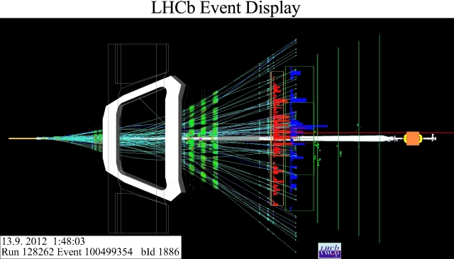

# Quantum optimization for particle tracking problems

## Abstract

This project investigates the application of quantum optimization algorithms to the problem of particle tracking in high-energy physics experiments. Such solutions are invaluable in high-energy particle experiments, such as the [LHCb](https://home.cern/science/experiments/lhcb/) experiment at [CERN](https://home.cern/), as they can be used to identify and characterize final-state particles. 
A quantum based optimization method may offer an alternative to established classical approaches in the case of such combinatorially complex problems.

The project will run for 8 weeks. Each week developing an optimisation toolset and building the combinartorial complexity of the problem. We begin with a classical formulation of a simplified particle tracking simulation. Then, once the classical approach is clear, we will move to studying quantum approaches, implementing simple quantum optimisation algorithms such as the Quantum Approximate Optimization Algorithm (QAOA) or quantum variational circuits applied to combinatorial optimisation problems.

*Image from LHCb experiment, CERN.*

##Week 1

We create a simple toy data set with which we can build example similarity matrices. We use heat maps and graph networks as visualisation tools.

The simplest tracking problem, requiring some level of optimisation, is two non-intersecting tracks in 2-dimensional space. We construct this system so that we have 6 equally spaced detectors on the interval $[0,1]$ as shown. External noise is modelled as a Gaussian for each hit. 

[2D track setup](plots/Toytracks.png)

The similarity matrix elements $W_{ij}$ quantify the compatibility or correlation between hits i and j. The more correlated two hits, the more likely it is that they correspond to the same particle track. Intuitively, a simialrity matrix should be symmetric. 
In this project, two main types used are:

1. k-nearest neighbours (KNN)
KNN matrices are discrete. Given a hit $i$, we find its k nearest neighbours $j = α,β...$. Such elements are taken as      1, otherwise it is 0.
   
2. Radial Basis Function (RBF)
RBF matrices are continuous and depends on the distance between hits, $d(i,j)$. Here we choose the standard $L_{2}$ metric.
The RBF formula uses an exponential with values taken between $0$ and $1$. The standard deviation parameter $\sigma$ models the leaniency over which compatibility applies.

$$
W_{ij} = \exp\bigl(-\frac{d(i,j)^2}{(2\sigma^2)}\bigr)
$$
   
The smaller the hit seperation, the greater their RBF correlation. 

## Week 2

Having built a simple toy system of two non-intersecting particle tracks, we now need to determine which hit correponds to which track (assuming we don't already know). This can be viewed as an optimisation problem!

In order to employ optimisation technqiues we need to map each possible way of assigning hits to tracks a unique configuration in state or 'label' space. This we accomplish by map each configuration to a binary string of twelve 0's and 1's where 0 and 1 distinguish which of the two tracks each hit belongs to. 

E.g. The configuration 010111010111 says: hit 1 is in track 0, hit 2 is in track 1, hit 3 is in track 0 etc. 

We then map this binary string space into a spin sequence of $+1$ and $-1$. Each of the 2^12 = 4096 possible configurations have been assigned a numerical state.

The constraint we place on the system is that the best configuration is the one that minimises the 'energy'. We develop an Ising-style Hamiltonian objective which admits the configuration spin sequence. Crucially, the Hamiltonian depends on the similarity matrix $W_{ij}$ in the same way as the magnetic coupling matrix does in the magnetism forumlation of the Ising model. 

$$
H = -\sum_{i<j}W_{ij}z_iz_j + \lambda \bigl(\sum_{i}z_i\bigr)^2
$$

Because we force $W$ to be symmetrical, the Hamiltonian is symmetric about flipping the signs of all spins in any sequence. This means that each energy level, whether we use the KNN or RBF matrix, will be at least two-fold degeneracy.
The second term acts as a penalty term, with the $\lambda > 0$ parameter enforcing how strict the peanlty term should be. This penalty term balances the first term by discouraging the all-in-one configurations of
111111111111 and 000000000000. 

Our expectation is of course that 000000111111 and its flipped state 111111000000 are the optimal groundstates. 

Visualisation of the system's energy landscape can be achieved by converting each configuration's binary string into its decimal equivalent and ordering the states numerically. 

For the purposes of simulating quantum circuits, the project uses the [Qiskit](https://github.com/Qiskit) and [Quiskit-aer](https://github.com/Qiskit/qiskit-aer) libraries. 

