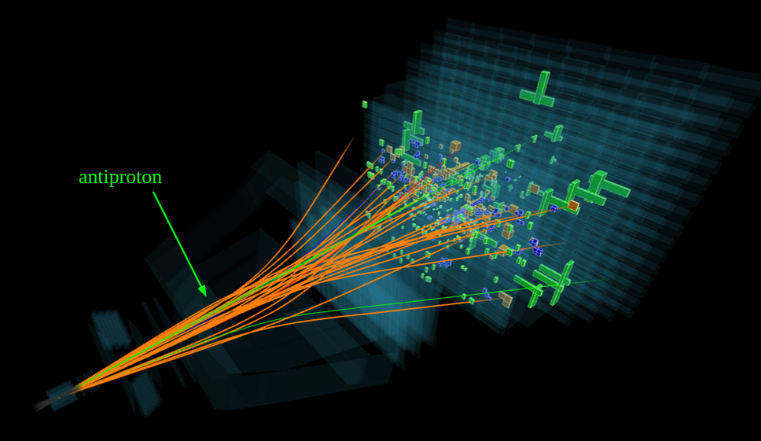

# QuantumTracking
Quantum optimization for particle tracking problems in Python.

Welcome to my project!

This project focuses on the problem of particle track reconstruction in high-energy particle physics experiments such as the [LHCb](https://home.cern/science/experiments/lhcb/) experiment at [CERN](https://home.cern/). Reconstructing particle trajectories is invaluable for identifying and parameterising the properties of final-state particles. 

*Image from LHCb group, CERN.

Traditioanlly classical methods have been generally used to tackle this problem, and have proved to be a reliable solution. But quantum computing might potentially offer an alternative strategy, and with it a faster computational output. However, modern quantum computers are severely hindered by very high levels of background noise, thus making them unfavourable for most computational problems... for now.

The aim of this project is to explore how quantum optimization algorithms might be applied to collider experiments to reproduce particle trajectories using python. For the purposes of simulating quantum circuits, the project uses the [Qiskit](https://github.com/Qiskit) and [Quiskit-aer](https://github.com/Qiskit/qiskit-aer) libraries. Corresponding classical algorithms will be used to build up the problem as comparatives to evaluate the performance of their quantum counterparts.

