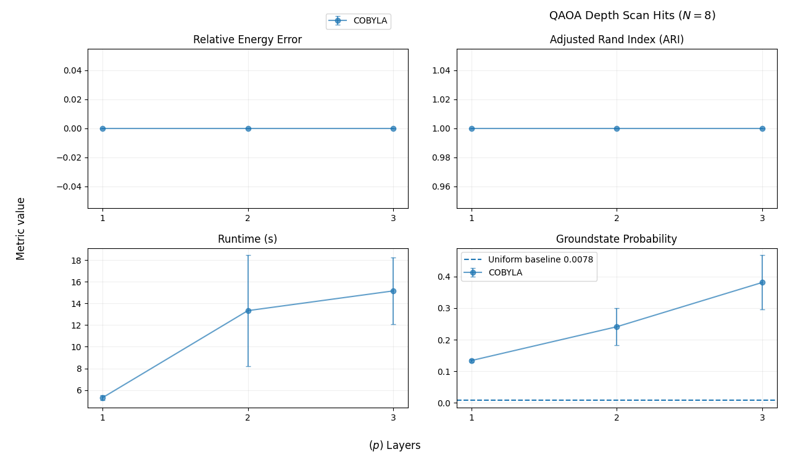

# Quantum optimization for particle tracking problems

## Abstract

This project investigates the application of quantum optimization algorithms to the problem of particle tracking in high-energy physics experiments. Such solutions are invaluable in high-energy particle experiments, such as the [LHCb](https://home.cern/science/experiments/lhcb/) experiment at [CERN](https://home.cern/), as they can be used to identify and characterize final-state particles. 
A quantum based optimization method may offer an alternative to established classical approaches in the case of such combinatorially complex problems.
Critically, this project does not seek algorithms that find an unknown answer to the tracking problem. We construct a simplfied problem for which the answer is known, allowing comparison of the different optimisation methods. 
The project's objectives are:

- Learn the principles of QAOA optimisation.
- Compare the performance of well-established classical methods against a quantum based algorithm.
- Learn whether a quantum approach might be valueable in solving this specific combinatorial problem.
- Analyse differences in performance between a noisy quantum simulator and real hardware.

The project will run for 8 weeks. Each week developing an optimisation toolset and building the combinartorial complexity of the problem. We begin with a classical formulation of a simplified particle tracking simulation. Then, once the classical approach is clear, we will move to studying quantum approaches, implementing simple quantum optimisation algorithms such as the Quantum Approximate Optimization Algorithm (QAOA) or quantum variational circuits applied to combinatorial optimisation problems.

## Table of Contents
- [Prerequisites](#prerequisites)
- [Week 1 - Setting the Problem Up](#week-1---introduction)
- [Week 2 - Brute Force Eenrgy Groundstate Search](#week-2---classical-methods)
    - [Energy Landscape](#energy-landscape)
- [Week 3 - Ising Formulation](#week-3---ising-formulation)
- [Week 4 - Building QAOA](#week-4---building-qaoa)
    - [QAOA - An Overview](#qaoa---an-overview)
- [Week 5 - A Better QAOA Optimiser](#week-5---a-better-qaoa-optimiser)
    - [Depth, Scale and niversal Scans](#depth-scale-and-universal-scans)
- [Week 6 - Adding Noise](#week-6---adding-noise)
- [Week 7/8 - Real Hardware Comparison](#week-7/8---real-hardware-comparison)
    - [Three-way Scan](#three-way-scan)
- [Further Notes on Implementation](#implementation)
- [References](#references)

---

## Prerequisites 
- Python version 3.12.0 or higher

## Week 1 - Setting the Problem Up

We create a simple toy data set with which we can build example similarity matrices. We use heat maps and graph networks as visualisation tools.

The simplest tracking problem, requiring some level of optimisation, is two non-intersecting tracks in 2-dimensional space. We construct this system so that we have $N=6$ equally spaced detectors on the interval $[0,1]$ as shown. External noise is modelled as a Gaussian for each hit. Later on in the project we will want to test the effect of varying $N$ on our slected algorithms.

The similarity matrix elements $W_{ij}$ quantify the compatibility or correlation between hits i and j. The more correlated two hits, the more likely it is that they correspond to the same particle track. Intuitively, a simialrity matrix should be symmetric. 
In this project, two main types used are:

1. k-nearest neighbours (KNN)
KNN matrices are discrete. Given a hit $i$, we find its k nearest neighbours $j = α,β...$. Such elements are taken as 1, otherwise it is 0. 
   
2. Radial Basis Function (RBF)
RBF matrices are continuous and depends on the distance between hits, $d(i,j)$. Here we choose the standard $L_{2}$ metric.
The RBF formula uses an exponential with values taken between $0$ and $1$. The standard deviation parameter $\sigma$ models the leaniency over which compatibility applies.

$$
W_{ij} = \exp\bigl(-\frac{d(i,j)^2}{2\sigma^2}\bigr)
$$
   
The smaller the hit seperation, the greater their RBF correlation. These matrices are square and can alternatively be viewed as a weighted, undirected graph network, each node corresponding to a hit. An edge between nodes $i$ and $j$ is weighted by the compatibility encoded in $ij$th entry of the similarity matrix, $W_{ij}$. This was acheived using the `networkx` package, please see [implementation](#implementation).

---

## Week 2 - Brute Force Eenrgy Groundstate Search

Having built a simple toy system of two non-intersecting particle tracks, we now use the similarity matrix to determine which hits correpond to which track (assuming we don't already know). This can be viewed as an optimisation problem!

### Energy Landscape

In order to employ optimisation technqiues we need to map each possible way of assigning hits to tracks a unique configuration in state or 'label' space. This we accomplish by map each configuration to a binary string of twelve 0's and 1's where 0 and 1 distinguish which of the two tracks each hit belongs to. 

E.g. The configuration $x = 010111010111$ says: hit 1 is in track 0, hit 2 is in track 1, hit 3 is in track 0 etc. 

We then map this binary string space into a spin sequence of $+1$ and $-1$. Mathematically this is done via,

$$
z_{i} = 2x_{i} - 1
$$

The constraint we place on the system is that the best configuration is the one that minimises the 'energy'. We develop an Ising-style Hamiltonian objective which admits the configuration spin sequence. Crucially, the Hamiltonian depends on the similarity matrix $W_{ij}$ in the same way as the magnetic coupling matrix does in the magnetism forumlation of the Ising model. 

$$
H = -\sum_{i<j} W_{ij} z_i z_j + \lambda \bigl(\sum_i z_i\bigr)^2
$$

Because we force $W$ to be symmetric, the Hamiltonian is symmetric about flipping the signs of all spins in any sequence. This means that each energy level, whether we use the KNN or RBF matrix, will be at least two-fold degeneracy. Crucially, there are two degenerate groundstate configurations.
The second term acts as a penalty term, with the $\lambda > 0$ parameter enforcing how strict the peanlty term should be. This penalty term balances the first term by discouraging the all-in-one configurations of $111111111111$ and $000000000000$. Our expectation is of course that $000000111111$ and its flipped state $111111000000$ are the optimal groundstates. 

### Brute force

Naively, we can find the system ground state by a brute force search. Each bitstring is mapped to an energy via Eq. (1), if we know the entire mapping we simply find the minimum, gauranteed for any $N$. Although, the size of our problem scales exponentially as $2^N$. Hence for small N, roughly $N \leq 12$, we can employ this brute force method with a reasonably small runtime. This is the method through which we find the true groundstates and its implementation is the purpose of Week 2.
(Insert Energy landscape plot)

---

## Week 3 - Classical Benchmark and Metrics

The exhaustive brute force method from Week 2 works well for small values of N. If $N=12$ then there are only $2^{12} = 4096$ possible cluster configurations, but this expoential growth severely caps performance. Even at $N=20$, there would be over one million possible configurations! 

We now implement and compare three new and targeted approaches to finding the best clustering for our simple tracking problem. These will serve as our classical baselines that we will compare with later quantum-based algorithms.

1. Greedy Algorithm
2. Spectral Clustering
3. Simulated Annealing

Performance metrics used to numerically compare each algorithm are runtime, ARI (of estimated groundstate against true groundstate) and relative error to the true groundstate energy. We expect Greedy to perform the worst. Being myopic means decisions are made locally which can severely bias the resultant configuration early in the algorithm leading to near-poor clusterings. Spectral Clustering on the other hand is a graph-minded approach with global decision making based on Graph topology.

Simulated Annealing can be seen as the classical twin of our later quantum methods. Thus, it will be the most important of our classical comparatives. Based on the well-known Metropolis Acceptance Criterion, a random initial configuration is selected and state-space is traversed stochatsically, all while being tempered by a cooling scheme. Ideally it approaches the global minimum but can very easily get trapped in a local minimum. Convergence traces, shown below, detail the energy evolution through the algorithm. Hence optimisation depends on the temperature, $T$, evolution. As $T$ decreases, overcoming energy barriers becomes harder leading to the trapping phenomenon in the energy landscape. 

Numerical performance analysis of each algorithm is realised through the following metrics:

1. Relative Energy Error (REE)
2. Runtime
3. Adjusted Random Index (ARI)

A successful run should return an REE of 0, and ARI of 1. Performance of the simulated annelaing (SA) algorithm can also be measured by the convergence success ratio. If we run the algorithm $m$ times, seeing as we know the true groundstates and their energies, we can test how many times, $n$, SA successfully converged to the true groundstate. The success fraction is $\frac{n}{m}$.

---

## Week 4 - Building the QAOA!

We have formulated and compared four classical baseline algorithms. In our small scale problem Simulated Annealing and Spectral Clustering perform brilliantly compared to Greedy Clustering, both returning the correct clusterings at the cost of slightly slower overall runtimes. Now we turn to formulating a simple quantum algorithm to tackle our problem! Implementation is done via [Qiskit](https://www.ibm.com/quantum/qiskit).

Our approach relies on the well-known Quantum Approximation Optimisation Algorithm (QAOA). Established by Farhi et al. [1](#ref1) in 2014, QAOA was applied to the [MaxCut Problem](https://en.wikipedia.org/wiki/Maximum_cut) and is closely related to the Quantum Adiabatic Algorithm.

This and following weeks are dedicated to building up the complexity of our QAOA. Beginning with the simplest case, using Qiskit's simulator `AerSimulator`, generalising to multi-layered circuits (Week 5) as well as implementing noise models (Week 6) to improve realism. To gain familiarity with QAOA, I used a simplified MaxCut problem as this weeks starting point, see MaxCutExmaple.py, using a simple grid search parameter optimisation. Once I had implemented a working QAOA MaxCut solution, I adapted it to the particle tracking problem. 

QAOA uses quantum mechanics to build up an optimal solution using **tuning parameters**. The biggest departure from classical algorithms, like those discussed above, lies in how the current 'state' moves in through the energy landscape. 
In a system of N hits, we have $2^N$ possible configurations. 
The Simulated Annealing state will move through configuration space step-by-step based on both an energy criterion and a cooling scheme. 
QAOA takes a fundamentally different approach. The state is described by a vector with $2^N$ amplitudes, one for each configuration. Upon measuring the statevector we collapse it to a single confiugration. Which state we observe is determined by a probability distribution function (PDF) that depends directly on the squared magnitudes of the complex statevector amplitudes.
Our job as the QAOA circuit designer is to malnipulate the statevector, using a careful arrangement of quantum gates and tuning parameters, so that the probability of observing the desirable low-energy configuration is amplified, whereas higher energy configurations are suppressed.
A comprehensive review of QAOA can be found in Blekos et al. [2](#ref2). 

### Choosing tuning parameters
If we have chosen to run a $p$ layer QAOA, we write our tuning parameters as $\boldsymbol{\gamma}$, $\boldsymbol{\beta}$ where both are vectors for the p cost and p mixer layers respectively. In total we have $2p$ tuning parameters to optimise for.

Before we can actually run the circuit, we need to chose $\boldsymbol{\gamma}$, $\boldsymbol{\beta}$ to assign to cost and mixer layers respectively. In Week 4, we optimise for their values with a simple grid search in the $2p$-dimensional parameter space. In this project, I restrict the search domain $\gamma_{i} \in [0, 2\pi)$ and $\beta_{i} \in [0, \pi)$ for all $i$. 

The primary drawback of the Grid Search is that it is non-adaptive; it tests fixed points in the parameter space instead of using previous results to find a better region to test. In addition, using nested `for` loops over a uniformly $K$ spaced grid, adding more QAOA layers increases the Grid Search domain as $K^{2p}$. Hence it is hugely profitable to replace Grid Search with an adaptive optimiser if we are going to explore the effetc of adding more layers. Many such strategies exist and our choice is explored in Week 5.

### QAOA as a Hybrid Algorithm
QAOA is actually implemented as a hybrid quantum-classical algorithm. This means that parts of the QAOA workflow where quantum computation isn't suitable are delegated to a classical computer. While the quantum computer runs the circuits and returns the sampled probability distribution, the classical computer will perform the $\boldsymbol{\gamma}$, $\boldsymbol{\beta}$ parameter optimisation. Optimisation is **not** carried out on a quantum computer. Pictorially, a typical QAOA workflow looks like this:

*Hybrid workflow of QAOA with p layers. 
Reproduced from Figure 3 of Blekos et al. [2](#ref2), licensed under CC BY 4.0.*

---

## Week 5 - A New Optimiser and Scans
In Week 4 I used the simplest possible parameter optimisation method, selecting a fixed set of independent points to test. However, as the parameter space grows, Grid Search becomes increasingly inefficient. If we want to explore the effect of adding more layers to the circuit, we need to consider a new optimiser. For this project, we will be analysing the gradient-free **COBYLA** (Constrained Optimisation BY Linear Approximation) method, available through SciPy's `minimize` function. Please see SciPy [COBYLA documentation](https://docs.scipy.org/doc/scipy/reference/optimize.minimize-cobyla.html). 
A wide range of other gradient-free methods are available that would also work in the context of this project, and include popular methods such as [Nelder-Mead](https://docs.scipy.org/doc/scipy/reference/optimize.minimize-neldermead.html) and [CMA-ES](https://cma-es.github.io/apidocs-pycma/index.html). 

### Depth, Scale and Universal Scans
Having chosen a new optimiser, we can now explore how QAOA performance changes when we change the problem **scale** $N$ for a fixed $p$, or circuit **depth** $p$ for a fixed $N$, without relying on the expensive runtime of a Grid Search. Note however that because of QAOA's hybrid nature the runtime can be split into classical runtime and quantum runtime, here we simply measure the total algorithm runtime. All performance metric results are given as distributions, rather than single anecdotal points, computing the mean and standard deviation to give a more representative finding. This requires iteration over different random seeds set in the backend through `backend.set_options(..., seed_simulator=(seed), ...)`, see `qaoa.qaoa.qaoa_pipeline`. 

We also introduce a new performance metric: Groundstate Probability (GSP). Given the number of shots, we compute an estimate of the probability of obtaining the groundstate upon measurement.

$$
\mathrm{GSP} = \frac{n_{\mathrm{GS}_{1}} + n_{\mathrm{GS}_{2}}}{N_{\mathrm{shots}}}
$$

where both $n_{\mathrm{GS}}$ values are the number of times each true degenerate groundstate was sampled. This GSP metric is only applicable to the QAOA, but is mathematically similar to the convergence fraction we used in when studying SA. Please see Week 6 below for a plot of my results.

To provide an complete comparison between all classical and quantum algorithms, I also implemented a **Universal** Scan for fixed $(N,p)$. The output table is a clean way to view performance discrepencies between classical and quantum methods. 

*Example Scale scan for $p=2$. Run on a noiseless simulator, results abide the expectation that more layers provides the means for a more expressive solution without the counterbalance of noise. Hence the increase in ARI and GSP, and corresponding decrease in REE. Averages taken over 5 different seeds, see [Implementation](#implementation).

---

## Week 6 - Adding Noise
Up until now we have worked on a noiseless simulator. As of now in 2026, real quantum hardware carries plenty of noise. Gates are imperfect, qubits can easily decohere and measurement is prone to error. Adding more operations increases the effect of error.
This week we implement a basic noise model using Qiskit's `NoiseModel` object, adding a single noise source through separate [depolarisation channels](https://en.wikipedia.org/wiki/Quantum_depolarizing_channel) for one- and two-qubit gates. We only consider the effects of one noise channel to study the impact of noise on the QAOA performance when $N$ or $p$ are varied.
Other models of quantum noise can be added including T1/T2 error and readout error to make the simulator more realistic and will be considered later in Week 7/8 when we actually use real hardware.

## Week 7/8 - Real Hardware Comparison
We have created a noisy simulator using Qiskit's `AerSimulator`, and we have compared it to our classical benchmarks in the universal scan. But how accurately does it compare to real quantum hardware? Seeing as we are using Qiskit, we can execute our circuit using IBM's Quantum Porcessing Units (QPUs) through the [IBM Quantum Platform](https://www.ibm.com/quantum?utm_content=SRCWW&p1=Search&p4=318569543695&p5=e&p9=194522864622&gclid=6bf19520fd951efefb05ff591a3581b2&gclsrc=3p.ds&msclkid=6bf19520fd951efefb05ff591a3581b2). 

Running a quantum circuitry on a QPU introduces hardware constraints that were absent in our idealised simulated circuit. Limited connectivity between qubits meaning a two-qubit operation between two arbitrary qubits cannot be performed directly between them. To account for connectivity overhead we transpile our ideal circuit, through Qiskit's `transpile` function. Mapping the logical qubits and gates in our idealised circuit to the physical qubits and basis gates used by the real QPU, we taylor our circuit to a specific QPU architecture. 
Different QPUs are built from different sets of basis gates, called native gates. Vitally, cost layer $R_{ZZ}$ gates are not a basis gate for any QPU available. Therefore, when we transpile our all-to-all circuit every $R_{ZZ}$ is decomposed into the equivalent progression of simpler quantum gates, $CNOT \to R_{Z} \to CNOT$. This hardware constraint is important since we must build our noise model around the native gate set. 

Our transpiled circuit can be considerably different from the original circuit, potentially increasing depth and gate count substantially, thereby increasing exposure to noise. The table below highlights this effect for a $N=6$ qubit circuit when transpiled around the IBM_miami QPU. Please see IBM_miami's [connectivity map](https://quantum.cloud.ibm.com/computers).

| Circuit Property | Ideal Circuit | Transpiled Circuit |
|:-----------------|--------------:|-------------------:|
| Number of qubits | 6 | 6 |
|Total Gate Count| 33 | 249 |
|Circuit Depth| 12 | 173 |
|Connectivity| All-to-All | Limited Coupling (Map) |

Importantly, the deliverable for Weeks 7 and 8 is the difference between noisy simulator and real hardware: does the noise model I built actually predict what real hardware does? We can analyse this difference through a three-way scan. A discrepency between the results can tell us which physical effects our noisy model doesn't factor in.

### Three-way Scan 
The threeway scan is a primary result of this project, where we compare performance between three different backends: 
1. Clean simulator
2. Noisy simulator
3. Real Hardware

Importantly, so far we have used a simulator to sample the resultant circuit probability distirbution and optimised our parameters using the adaptive COBYLA method. Here we are investgating real hardware. If we were to carry out the same restart and seed iteration from used in Weeks 5 and 6, we would burn through our QPU processing-time budget instantly. This is because Scipy's `minimize` function will call the circuit many times as it tries to minimise our Hamiltonian. Therefore, we do not optimise on hardware!!! 

---

### Week 8 Experiment

Throughout the study all variables are kept the same:
- Similarity Matrix Type
- $\lambda$
- A fixed point in the problem size parameter space $(N, p)$
- The circuit

The fourth item is very importance. Across all three backends, we run the same transpiled circuit, with the same $N$, $p$, $\mathbf{\gamma}$ and $\mathbf{\beta}$. Crucially, **this circuit is run only once**. This transpiled circuit is first optimised via the noisy simulator, which returns the best $2p$ tuning parameters $\mathbf{\gamma}$ and $\mathbf{\beta}$, and then run once on each backend. This is because, as per the discussion above, we cannot optimise on real hardware, and so we should only run the circuit once. To keep the experiment controlled, we also do this for both clean and noisy simulators. In order to take advantage of the warm restarts, I choose to optimise using the depth scan, by fixing $N$ and iterating until $p$ is reached. 

---

## Further Notes on Implementation

Across this project, [NumPy](https://numpy.org/) and [Matplotlib](https://matplotlib.org/) have been used extensively in data collection and visualisation. 

#### Weeks 1-3
- Construction of two linear tracks controlled with noise parameter track_noise and intersection boolean intersection_allowed.
- Graphical similarity matrix visualisation as heatmaps and graphs was implemented using matplotlibs `imshow` function and the `networkx` package respectively. 

- Classical benchmark algorithms implemented in `classical/classical_benchmarks.py`. Each has nearly identical handling functions but because of SA convergence trace and convergence fraction output, I decided coding each individually would be best for clarity.
- Averages are obtained through a `for` loop over `classical_loop` for each algorithm. Dictionary methods are employed to store algorithm results. 

1. Greedy clustering - iterate through all pairs of hits such that they are in different tracks. Local decisions based o the chosen $W$.
2. Spectral Clustering - implemented using `sklearn.cluster.SpectralClustering` method with `no_of_clusters = 2` and   `affinity = 'precomputed'`. Note a warm-up run is included to balance the runtime comparison.
3. Simulated Annealing - Cooling scheme is exponential, with base = $0.999$. Pertubation of the current state is performed using single bit built-in XOR `^` function.

#### Weeks 4-6
- Rotation angle inputs into $R_{ZZ}$ and $R_{X}$ are multiplied by 2 to cancel Qiskit $\frac{1}{2}$ convention. 
- Qiskit `Parameter` object is used to build the generalised circuit then assign specific **$\boldsymbol{\gamma}$, $\boldsymbol{\beta}$** values during their optimisation. 
- Iteration flow to obtain QAOA metric data: `seed_lim` $\to$ `restarts`. The best restart is obtained based on a simple energy comparison: the lowest energy obtained by the COBYLA search is that seed's best estimate for $\boldsymbol{\gamma}$, $\boldsymbol{\beta}$. 
- After Week 5, I tweaked the iteration flow to include one warm restart. In the depth scan, when optimisaing on a $p$-layer circuit, the first restart will use the best previous $(p-1)$-layer circuit parameters. Hence the warm-restart gets a head start on the optimisation, whereas the other restarts are regular random selection from the search domain.
- All types of noise added to the `NoiseModel` object are implemented as functions in `noise/add_noisemodel.py`. For my study I added readout and depolarisation channels, however the option to add a T1/T2 error is available, (uncomment line 62 and probably adjust input parameters).

#### Weeks 7-8
- Code is further split using `mode` conditional. 
- Normal Week 5 depth, scale and universal experiments can be carried out by setting `mode = 1` and selecting the desired experiment type with string variable `experiment_option`. 
- `mode = 2` performs the Week 7/8 threeway scan. Since the pre-optimisation is carried out with a default depth scan, `experiment_option` is overwritten to `'depth'`.
- After pre-optimisation and single-run circuits on the clean and noisy simulators in `execution/run_sim_threeway.py`, real hardware job submission takes place using `execution/submit.py` followed by `execution/fetch.py`.
- Job submission is done using an Qiskit Batch session with `sampler = Sampler(mode=batch)`, with import `from qiskit_ibm_runtime import Batch, SamplerV2 as Sampler`. Each batch contains `job_repeats = 3` jobs. 

---

## References

[1] E. Farhi, J. Goldstone and S. Gutmann, 
[*A Quantum Approximate Optimization Algorithm*](https://arxiv.org/abs/1411.4028),
arXiv:1411.4028 (2014).

[2] K. Blekos, D. Brand, A. Ceschini, C.-H. Chou, R.-H. Li, K. Pandya and A. Summer, 
[*A Review on Quantum Approximate Optimization Algorithm and its Variants*](https://arxiv.org/abs/2306.09198), 
*Physics Reports*, **1068**, 1–66 (2024). 
https://doi.org/10.1016/j.physrep.2024.03.002